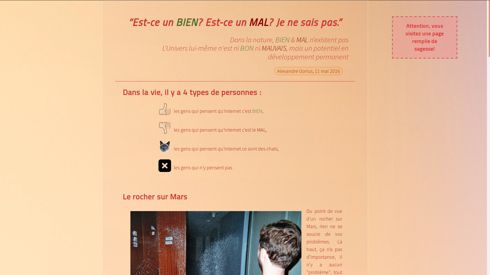

# Exercice d'amélioration progressive

* Première page créée de A à Z par Gaëlle Gaban (contenu de la page fournis) | [Github](https://github.com/Gaellga)    
* Réalisée en janvier 2019 dans le cadre de la formation BeCode  
* Première expérience avec HTML5 et CSS3
* Projet terminé 

## Lien vers les consignes
https://github.com/becodeorg/BXL-Johnson-3.9/tree/master/Projets/progressive-enhancement

## Langages utilisés  

* HTML5
* CSS
* Markdown

## Credits
* Le contenu et les images de la page proviennent de [cet article](https://medium.com/scribe/il-ny-a-rien-de-bien-ni-de-mal-3d46a2d2e263)    
* Le favicon provient de [Flaticon](https://www.flaticon.com/)   

### Vous pouvez accéder au site via la [Github page](https://gaellga.github.io/progressive-enhancement/) ou vous rediriger vers son [repository GitHub](https://github.com/Gaellga/progressive-enhancement).